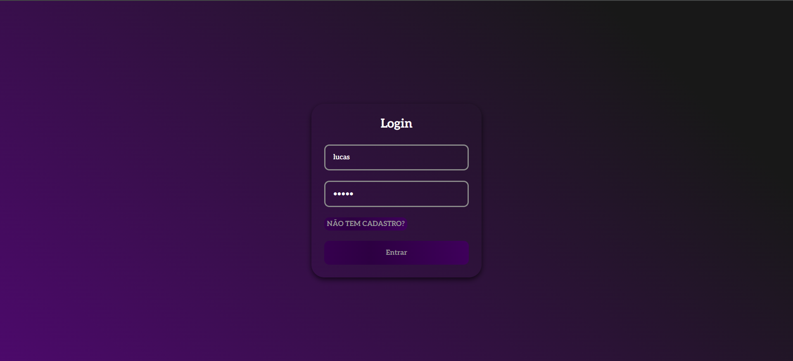
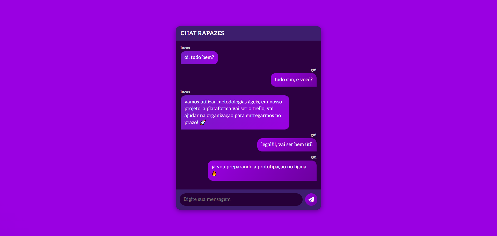
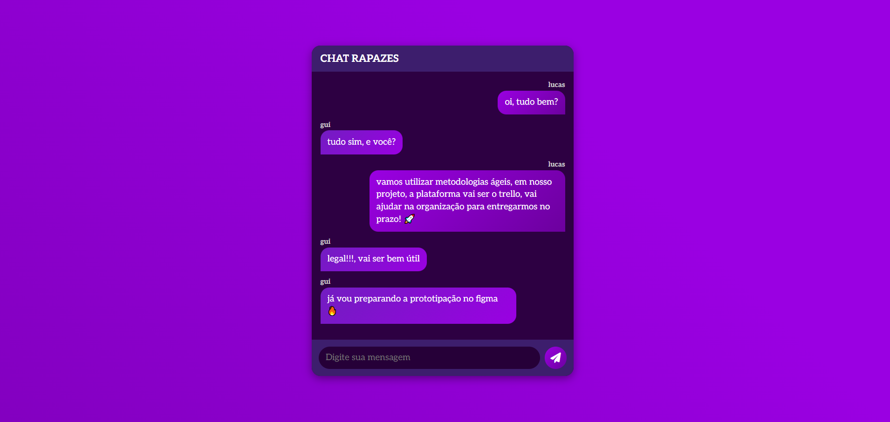

# 💬 ChatWeb

**ChatWeb** é uma aplicação de chat em tempo real desenvolvida com **Flask**, **Socket.IO**, **HTML**, **CSS**, **JavaScript** e **SQL**. O sistema permite múltiplos usuários trocando mensagens instantaneamente em uma interface responsiva e intuitiva.

## 🚀 Tecnologias Utilizadas

- **Python** + **Flask**
- **Flask-SocketIO**
- **SQL** (para armazenamento de dados)
- **HTML5** e **CSS3**
- **JavaScript**

## 🔧 Funcionalidades

- Comunicação em tempo real com WebSockets
- Notificações de entrada e saída dos usuários
- Armazenamento de mensagens com SQL
- Entrada com nome de usuário
- Interface responsiva

- 
- 
- 
